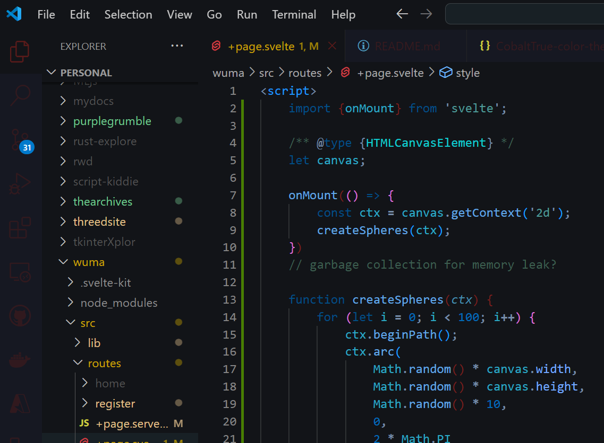

# CobaltTrue
Monotone Blues with Green Splashed




I use these workbench settings:
```
  "editor.bracketPairColorization.enabled": true,
  "workbench.colorCustomizations": {
    "editorBracketHighlight.foreground1": "#591B1A",
    "editorBracketHighlight.foreground2": "#F37894",
    "editorBracketHighlight.foreground3": "#A1EEBD"
  }
```


## Based on Nautical Color Palette
Originally, I had gone with a purple, blue & teal palette.
After a while it was looking more like the infamous NightOwl and that wasn't my goal.

I wanted something that was more reliant on contrast than color.
I've been a big champion of Dark+, but frankly it was a bit too bright and the color scheme was something to be desired.

The objective of this theme was to deliver a subdued 'monotone' blue-centric dark theme.


## ON THE HORIZON:
- [ ] Further testing to solidify color themeing
- [ ] Investigate color theme for file formats related to data structure/content (i.e. .json, .md, .bson, etc.)
- [ ] Investigate color theme for other languages
- [ ] Consider parenthesis recolor and priority contrast
- [ ] Night vs Day use, impacts/ease of use/readability/eye strain
- [ ] Testing impact of 'monotone' use of similar hues
- [ ] Color Themeing for GitHub source changes and file modifications
- [ ] Themeing for error handling and CSS structure
- [ ] A11y compliancy checks
- [ ] Debugging Themeing
- [ ] Highlight color masks some of the selected text


***This is still a work in progress. Currently working on supporting C# syntax (4/10/24).***
*Feel free to share your thoughts and opinions about the theme. This is my first hand at developing a color theme.*

| Ver | Description | Features |
|----:|-------------|----------|
|0.0.1|initial      |skeleton  |
|1.0.0|first maj    |designed for python use, semantic Highlighting enabled, blue-centric themeing, "infrared" accentures, contrast approach|
|1.2.0|minor        |retooling themeing, adding support for data structures and more |
|1.3.0|minor        |subdued terminal foreground, var props contrast adjustment, markdown coloring, debug toolbar |
|1.6.1|minor        |version glitch jumped to 1.6... recolor css id and class selectors |
|1.6.3|minor        |updated screencaps on rdme|
|1.6.4|minor        |json levels recolor|
|1.7.0|minor        |adding support for C# projects, json slight recolor|
